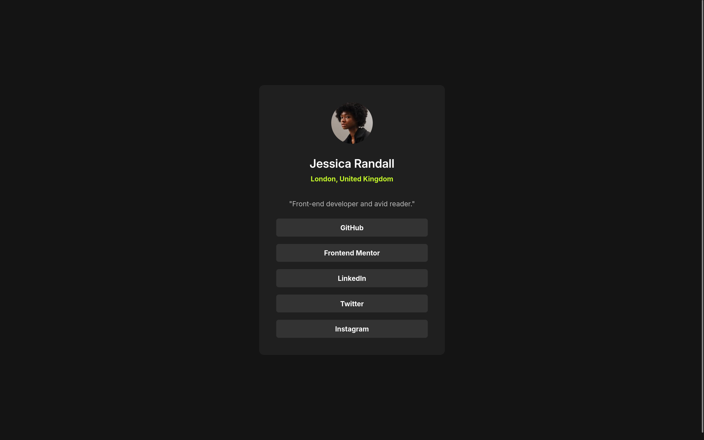
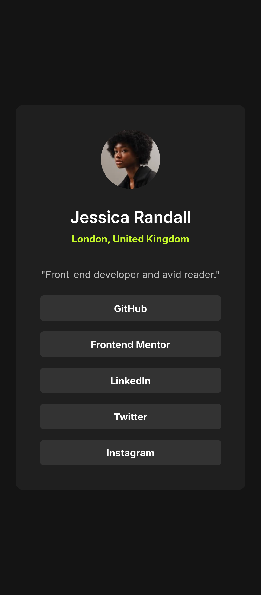

# 🌐 Social Links Profile

[](https://developer.mozilla.org/en-US/docs/Web/HTML) 
[](https://developer.mozilla.org/en-US/docs/Web/CSS) 
[](https://www.frontendmentor.io/)

A modern and responsive **social links profile card** built as a Frontend Mentor challenge. This project demonstrates HTML & CSS skills with clean, semantic code.

---

## ✨ Features
- ✅ Fully responsive (Mobile & Desktop)
- ✅ Semantic HTML structure
- ✅ Clean and organized CSS
- ✅ Hover effects for social links
- ✅ Easy to customize and extend

---

## 🎨 Design
Inspired by a [Frontend Mentor challenge](https://www.frontendmentor.io/).  
The design strictly follows Figma specifications for **mobile** and **desktop** views.

---

## 📸 Screenshots

**Desktop View**  


**Mobile View**  


---

## 💻 Technologies Used
- **HTML5**
- **CSS3**
- **Responsive Design** (Flexbox & Grid)

---

## 🚀 Getting Started
1. Clone the repository:
```bash
git clone https://github.com/Esraa-Abdallah21010/Social-links-profile.git
